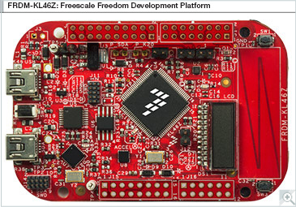
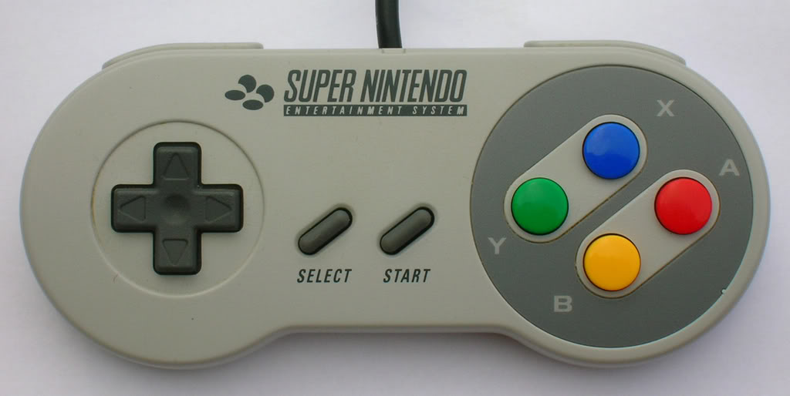

# #lighthack KL46 SNES

## Connects a Nintendo SNES controller to [ETC EOS](http://www.etcconnect.com) via OSC over USB

### Hardware
Created as a [Kinetis® Design Studio](https://www.nxp.com/products/wireless-connectivity/zigbee/kinetis-design-studio-integrated-development-environment-ide:KDS_IDE) project for [FRDM-KL46Z](https://www.nxp.com/products/processors-and-microcontrollers/arm-based-processors-and-mcus/kinetis-cortex-m-mcus/l-seriesultra-low-powerm0-plus/freedom-development-platform-for-kinetis-kl3x-and-kl4x-mcus:FRDM-KL46Z) (Freedom Development Platform for Kinetis KL3x and KL4x MCUs) from NXP

### SNES Button functions

| SNES BUTTON   | EOS ACTION    | 
|:-------------:|:-------------:|
| UP            | Tilt Up       |
| DOWN          | Tilt Down     |
| LEFT          | Pan Left      |
| RIGHT         | Pan Right     |
| SELECT        | Highlight     |
| START         | Chan 1        |
| L             | Prev          |
| R             | Next          |
| Y             |               |
| X             |               |
| B             |               |
| A             |               |

### SNES Pinout:
<pre>
 ----------------------------- ---------------------
|                             |                      \
| (1)     (2)     (3)     (4) |   (5)     (6)     (7) |
|                             |                      /
 ----------------------------- ---------------------</pre>
| SNES PIN      | KL46 PIN      | LABEL      |
|:-------------:|:-------------:|:----------:|
| 1             | +3.3v         | +3.3v      |
| 2             | PTC8 (Pin 84) | Data Clock |
| 3             | PTC9 (Pin 89) | Data Latch |
| 4             | PTA13 (Pin 43)| Serial Data|
| 5             | N/C           | N/C        |
| 6             | N/C           | N/C        |
| 7             | GND           | GND        |
